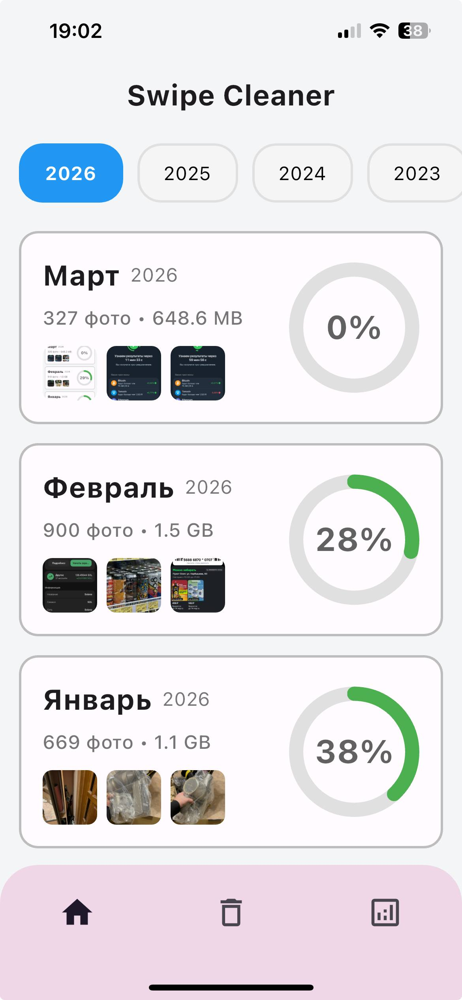
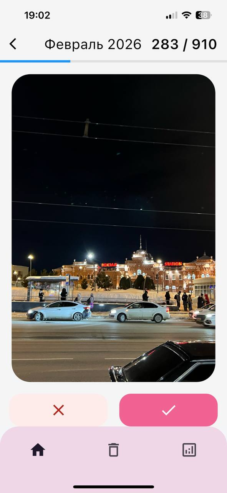
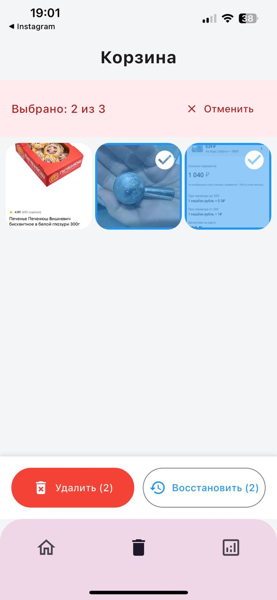
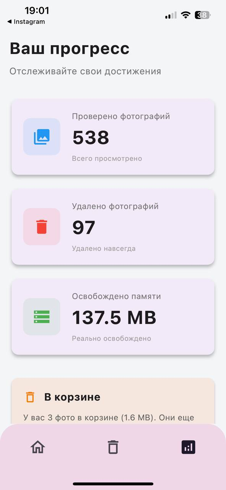

# Swipe Cleaner

Приложение для удобной очистки галереи на iPhone. Листайте фотографии как карточки — свайп влево удаляет, свайп вправо оставляет.

## Экраны

| Главная | Свайп | Корзина | Статистика |
|---------|-------|---------|------------|
| Список месяцев с превью | Карточки фото со свайпом | Сетка фото к удалению | Прогресс и достижения |
|  |  |  |  |

## Функционал

### 🏠 Главный экран
- Группировка фотографий по месяцам и годам
- Карточки месяцев с превью (до 3 фото), названием, количеством и размером
- Переключатель по годам
- Pull-to-refresh

### 🃏 Экран свайпа
- Свайп влево — отправить в корзину
- Свайп вправо — оставить
- Кнопки действий внизу (❌ / ✅)
- Прогресс-бар просмотра
- Счётчик фото
- Пропуск уже просмотренных фото при повторном входе

### 🗑️ Корзина
- Сетка фото, отмеченных к удалению
- Мультивыбор (тап / долгий тап)
- Выбрать все / снять выбор
- Окончательное удаление или восстановление
- Баннер с количеством и размером фото в корзине

### 📊 Статистика
- Количество просмотренных фотографий
- Количество удалённых фотографий
- Объём освобождённой памяти
- Предупреждение о фото в корзине
- Карточка достижений

## Технологии

- **Flutter** — UI фреймворк
- **Riverpod 2** — управление состоянием
- **Hive** — локальное хранилище (корзина, статистика, история просмотров)
- **photo_manager** — доступ к галерее
- **permission_handler** — управление разрешениями
- **intl** — форматирование дат

## Структура проекта

```
lib/
├── main.dart                         # Точка входа (debug)
├── main_release.dart                 # Точка входа (release)
├── models/                           # Модели данных
│   ├── photo_item.dart               # Фотография
│   ├── month_group.dart              # Группа по месяцу
│   ├── deleted_photo.dart            # Фото в корзине
│   ├── viewed_photo.dart             # История просмотров
│   ├── app_statistics.dart           # Статистика
│   └── card_interaction_mode.dart    # Режим взаимодействия
├── providers/                        # Riverpod провайдеры
│   ├── permission_provider.dart
│   ├── month_groups_by_year_provider.dart
│   ├── month_groups_provider.dart
│   ├── deleted_photos_provider.dart
│   └── viewed_photos_provider.dart
├── screens/                          # Экраны
│   ├── main_navigation.dart          # Bottom navigation
│   ├── home/                         # Главный экран
│   ├── photo_swipe/                  # Экран свайпа
│   ├── deleted_photos/               # Корзина
│   └── statistics/                   # Статистика
├── widgets/                          # Общие виджеты
│   ├── swipeable_photo_card.dart
│   ├── month_card.dart
│   └── permission_request_widget.dart
└── theme/                            # Цвета и тема
```

## Запуск

```bash
flutter pub get
flutter run                  # debug
flutter run -t lib/main_release.dart   # release
```

## Разрешения

### iOS
- `NSPhotoLibraryUsageDescription` — доступ к фото
- `NSPhotoLibraryAddUsageDescription` — управление фото

### Android
- `READ_EXTERNAL_STORAGE` (Android ≤ 12)
- `READ_MEDIA_IMAGES` (Android ≥ 13)
- `WRITE_EXTERNAL_STORAGE`

## Roadmap

- [ ] Редизайн экрана статистики — современный визуальный стиль
- [ ] Поиск дубликатов
- [ ] Фильтры по размеру / типу файлов
- [ ] Темная тема
- [ ] Локализация (EN)
